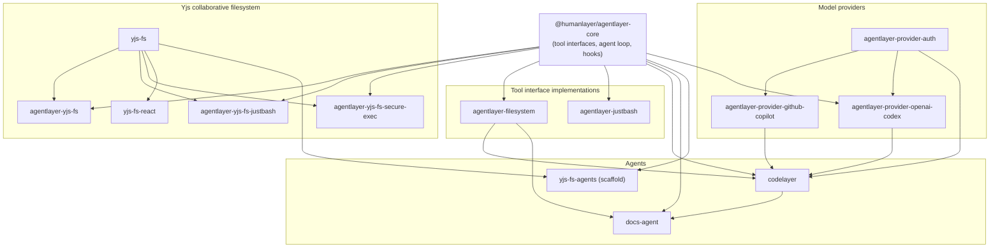

# AgentLayer

AgentLayer is HumanLayer's toolkit for building coding agents. It is a [Bun](https://bun.com) monorepo centered on `agentlayer-core` — a resumable agent loop with tool interfaces kept separate from their executors — with filesystem, sandboxed-bash, CRDT-collaborative, and model-provider packages plugging into those interfaces, and full agents (like `codelayer`) assembled on top.

## Package Relationships



`opencode-llm-vendor` is a standalone, provider-agnostic Effect-based LLM client with no in-repo dependencies or dependents.

## Monorepo Map

| Package | Path | Description |
| --- | --- | --- |
| `@humanlayer/agentlayer-core` | [`packages/agentlayer-core`](packages/agentlayer-core) | Core resumable agent loop (Vercel AI SDK `streamText`) with tool-interface/executor separation, approval hooks, stop conditions, prompts, and isomorphic built-in tools. |
| `@humanlayer/agentlayer-filesystem` | [`packages/agentlayer-filesystem`](packages/agentlayer-filesystem) | Filesystem-backed implementations of core's tool interfaces (read/write/edit/apply_patch/glob/grep/list/bash) for local-directory coding agents. |
| `@humanlayer/agentlayer-justbash` | [`packages/agentlayer-justbash`](packages/agentlayer-justbash) | Tool interface adapters built on Vercel's `just-bash` virtual/in-memory bash environment. |
| `@humanlayer/agentlayer-provider-auth` | [`packages/agentlayer-provider-auth`](packages/agentlayer-provider-auth) | Stores and normalizes provider credentials (OAuth tokens, API keys) with in-memory and file-backed implementations. |
| `@humanlayer/agentlayer-provider-github-copilot` | [`packages/agentlayer-provider-github-copilot`](packages/agentlayer-provider-github-copilot) | AI SDK v3 provider for GitHub Copilot's chat API, including device-code OAuth. |
| `@humanlayer/agentlayer-provider-openai-codex` | [`packages/agentlayer-provider-openai-codex`](packages/agentlayer-provider-openai-codex) | AI SDK ProviderV3 implementation for OpenAI's Codex/ChatGPT responses API, plus ChatGPT OAuth. |
| `@humanlayer/agentlayer-yjs-fs` | [`packages/agentlayer-yjs-fs`](packages/agentlayer-yjs-fs) | Binds core's filesystem tool interfaces to a Yjs CRDT-backed filesystem, with presence hooks for real-time collaborative editing. |
| `@humanlayer/agentlayer-yjs-fs-justbash` | [`packages/agentlayer-yjs-fs-justbash`](packages/agentlayer-yjs-fs-justbash) | Bash tool that runs shell commands via `just-bash` against a Yjs filesystem, with a presence hook. |
| `@humanlayer/agentlayer-yjs-fs-secure-exec` | [`packages/agentlayer-yjs-fs-secure-exec`](packages/agentlayer-yjs-fs-secure-exec) | Adapts the Yjs filesystem into `secure-exec`'s sandboxed Node runtime as a `secure_exec` tool. |
| `@humanlayer/agentlayer-docs` | [`packages/docs`](packages/docs) | VitePress documentation site for AgentLayer, plus a Pulumi program to deploy it to S3/CloudFront. |
| `@humanlayer/opencode-llm-vendor` | [`packages/opencode-llm-vendor`](packages/opencode-llm-vendor) | Effect-based, provider-agnostic LLM client (vendored from opencode) streaming typed events over HTTP/WebSocket. |
| `@humanlayer/yjs-fs` | [`packages/yjs-fs`](packages/yjs-fs) | Transport-neutral, CRDT-backed virtual filesystem (built on Yjs) with content, comments, and live-cursor presence. |
| `@humanlayer/yjs-fs-react` | [`packages/yjs-fs-react`](packages/yjs-fs-react) | React context provider and hooks for reactive access to a shared `yjs-fs` session. |
| `@humanlayer/codelayer` | [`agents/codelayer`](agents/codelayer) | Multi-provider coding agent CLI (Anthropic/OpenAI/Codex/Copilot/Fireworks) with RPI-style sub-agent orchestration. |
| `@humanlayer/docs-agent` | [`agents/docs-agent`](agents/docs-agent) | CI agent that reviews and updates AgentLayer's markdown docs to stay in sync with source changes on pull requests. |
| `@humanlayer/yjs-fs-agents` | [`agents/yjs-fs-agents`](agents/yjs-fs-agents) | Empty scaffold package; the working example lives in `examples/yjs-fs-agent`. |

## Getting Started

Install dependencies:

```bash
bun install
```

Key commands:

```bash
bun run test        # run tests
bun run typecheck   # typecheck with tsgo
bun run biome       # run the biome formatter across the repo
bun check           # run typecheck, biome, and tests in parallel (preferred verification step)
```

To scope a command to a single package: `bun run --cwd packages/<name> typecheck`.

## Contributing

See [`CONTRIBUTING.md`](CONTRIBUTING.md) for the full contribution policy. In short: issues are open to everyone (except denounced users), and external pull requests need a vouch — join [our Discord](http://humanlayer.com/discord), introduce yourself with your GitHub username and what you want to work on, and a maintainer can vouch for you.

Maintainers should see `MAINTAINERS.md` for Vouch operations and repository moderation guidance.
