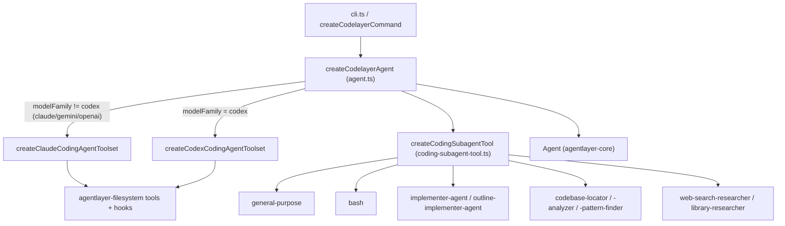

# codelayer

`codelayer` is AgentLayer's reference coding agent — a multi-provider CLI (`@humanlayer/codelayer`) built on `agentlayer-core` and `agentlayer-filesystem`. It wires a `LanguageModel` (Anthropic, OpenAI, Codex, Copilot, or Fireworks/"firepass") to a filesystem-backed coding toolset, sub-agent orchestration, and provider-specific reasoning/thinking controls.

## Run it

```bash
bun run cli --provider anthropic --model claude-opus-4-5 --prompt "list the files in src/"
# or after publish:
bunx codelayer --provider codex --rpi
```

Auth: reads `ANTHROPIC_API_KEY` / `OPENAI_API_KEY` / `FIREWORKS_API_KEY` from the environment, falling back to AgentLayer's file-based auth store (`~/.humanlayer/agent-sdk`) for `anthropic`, `codex`, `copilot`, and `firepass`. `EXA_API_KEY` enables web search for research sub-agents.

Key flags (see `createCodelayerCommand` in `src/command.ts`): `-p/--provider`, `-m/--model`, `--thinking <level>`, `--subagent-thinking <level>`, `--rlm` (orchestrator mode with a generic subagent tool), `--rpi` (nudges the system prompt to prefer delegating to the RPI specialist sub-agents, which are otherwise always present in the roster), `--tars` (adds the TARS persona), `--provider-option key=value` (repeatable; e.g. `codex.reasoningEffort=xhigh`, `anthropic.thinking=enabled`).

## Programmatic usage

```ts
import { createCodelayerAgent, resolveModel } from '@humanlayer/codelayer'
import { startState } from '@humanlayer/agentlayer-core'

const model = await resolveModel('anthropic', 'claude-opus-4-5')
const agent = await createCodelayerAgent({ model, cwd: process.cwd(), rpi: true })
const run = agent.run({ state: startState([{ role: 'user', content: 'fix the failing test' }]) })
```

`createCodelayerAgent` (`src/agent.ts`) builds an `Agent` from `agentlayer-core`, selecting a Claude- or Codex-flavored toolset via `detectModelFamily(model)` and merging `agentlayer-filesystem`'s default hooks (output truncation, file-state tracking) with any caller-supplied `hooks`. Provider-specific reasoning knobs (Anthropic `thinking`/`effort`, Codex `reasoningEffort`/`reasoningSummary`/`fastMode`, Copilot `reasoningEffort`) are resolved by `buildProviderOptions`/`resolveAnthropicThinking`/`resolveCodexThinking`, with `subagentThinkingOverrides` throttling delegated sub-agents (default `low`) relative to the parent.

## Sub-agents

`createCodingSubagentTool` (`src/coding-subagent-tool.ts`) assembles a `createSubagentsTool` from `agentlayer-core` with a fixed roster of child `Agent`s, each scoped to its own tools and system prompt: `general-purpose`, `bash`, plus the RPI specialists from `src/rpi-agents/` — `implementer-agent`, `outline-implementer-agent`, `codebase-locator`, `codebase-analyzer`, `codebase-pattern-finder`, `web-search-researcher`, and (when `exaApiKey`/`context7ApiKey` is set) `library-researcher`. The individual RPI specialist-agent factories (e.g. `createCodebaseLocatorAgent`) are exported separately via the `./rpi-agents` entry point so other agents in the monorepo can reuse them.

When `rlm: true`, `createCodelayerAgent` runs the top-level agent in orchestrator mode: a minimal read/write/edit(or apply_patch) toolset plus the subagent tool, biased toward delegating work instead of doing it inline.



## Key exports (`src/index.ts`)

- `createCodelayerAgent(opts: CodelayerAgentOptions): Promise<Agent>` — main agent factory.
- `buildProviderOptions` — provider reasoning-option helper.
- `createCodelayerCommand(): Command` — the commander.js CLI definition used by `src/cli.ts`.
- `createCodingSubagentTool` — standalone sub-agent-tool factory.
- `resolveModel`, `DEFAULT_MODELS`, `resolveExaApiKey` (from `src/providers.ts`) — turns a `(provider, modelId)` pair into a `LanguageModel`.

## Depends on

`@humanlayer/agentlayer-core`, `@humanlayer/agentlayer-filesystem`, `@humanlayer/agentlayer-provider-auth`, `@humanlayer/agentlayer-provider-github-copilot`, `@humanlayer/agentlayer-provider-openai-codex`.

## Tests

`bun run test` runs `test/agent.test.ts` and `test/coding-subagent-tool.test.ts`, covering provider-option resolution, tool-suite gating per model family, sub-agent thinking throttling, and the read tool's multimodal (image) support.
