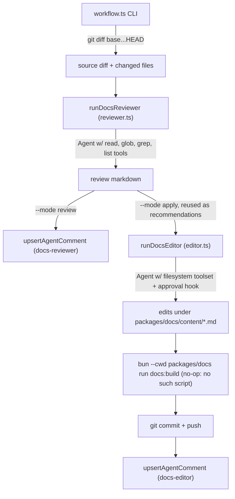

# docs-agent

A CI agent that keeps `packages/docs/content/` in sync with source changes on pull requests. It runs in two modes: **review** posts a PR comment assessing whether docs coverage is adequate for a diff; **apply** edits the markdown docs, runs a docs build check (currently a no-op — `packages/docs` has no `docs:build` script, so the invocation prints Bun's usage help and exits 0 without building anything), and commits/pushes the result.

## How it runs

Triggered by `.github/workflows/docs-agent.yml`:
- `pull_request` (opened/synchronize/reopened) touching `packages/**/src/**` or `agents/**/src/**` → runs `review`.
- Commenting `@docs-agent apply` on a PR (as an owner/member/collaborator) → runs `apply`.
- Manual `workflow_dispatch` for either mode.

```bash
bun run --cwd agents/docs-agent docs-agent:workflow \
  --mode review \
  --pr-number 123 \
  --sha <head-sha> \
  --repo humanlayer/agentlayer \
  --base-ref main
```

Required env: `GH_TOKEN` (or `--gh-token`) unless `--dry-run` is passed. Both modes need `FIREWORKS_API_KEY` to actually invoke the LLM agent; without it `apply` throws (or, in `--dry-run`, no-ops), and `review` throws too — unless `--dry-run` is passed, in which case `review` always returns a heuristic comment regardless of whether the key is set.

## Workflow



`workflow.ts` (`src/workflow.ts`) is the CLI entry point (Commander-based). It diffs `base-ref...HEAD` under the `packages/` and `agents/` directories, then filters the resulting changed-file list (used for the run gate and prompt file list, not the diff text itself) down to `packages/**/src/**` and `agents/**/src/**` paths, then:
- **review**: calls `runDocsReviewer`, wraps the result, and upserts a marked PR comment (`docs-reviewer`).
- **apply**: reuses an existing `docs-reviewer` comment if present (else runs the reviewer inline), calls `runDocsEditor`, runs `bun --cwd packages/docs run docs:build` as a build check (currently a no-op — see above), commits/pushes any changed files under `packages/docs/content/`, and upserts a `docs-editor` PR comment. It refuses to run if `packages/docs/content/` already has uncommitted changes.

## Key exports (`src/index.ts`)

- `runDocsReviewer(opts: { cwd, diff, changedFiles, dryRun? })` — a read-only `Agent` (firepass model, `read`/`glob`/`grep`/`list` tools from `@humanlayer/agentlayer-filesystem/tools`) that inspects existing docs and returns a `## Verdict` / `## Recommended Updates` / `## Files Worth Updating` markdown report.
- `runDocsEditor(opts: { cwd, diff, recommendations, dryRun? })` — an `Agent` with the full filesystem toolset (`createClaudeAgentFilesystemToolset`, which includes an unrestricted `bash` tool) gated by a `createApprovalHook([WriteTool, EditTool], ...)` that denies `write`/`edit` tool calls outside `packages/docs/content/*.md`; the hook does not cover `bash`, which can act anywhere on disk.
- `loadAgentComment` / `upsertAgentComment` (`src/github.ts`) — find/create/update a PR comment tagged with an HTML marker `<!-- <agentName>:sha=<sha> -->`, used to keep one comment per agent per PR instead of spamming new ones.

## Dependencies

Built on `@humanlayer/agentlayer-core` (`Agent`, `startState`, `maxSteps`, `createApprovalHook`, `extractLastAssistantText`, `WriteTool`, `EditTool`), `@humanlayer/agentlayer-filesystem` (read/glob/grep/list tools and the combined filesystem toolset), and `@humanlayer/codelayer` (`resolveModel`, `DEFAULT_MODELS`) for provider/model resolution.
