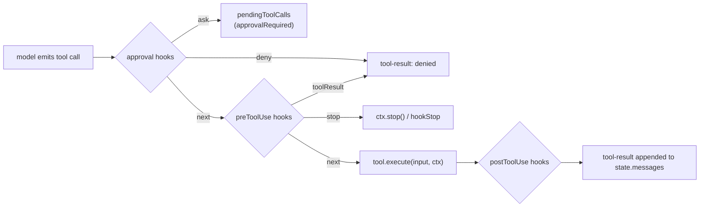

# agentlayer-core

The core agent loop for AgentLayer. Wraps Vercel AI SDK's `streamText` in a resumable,
approval-aware tool-execution loop, and defines the interfaces that platform packages
(`agentlayer-filesystem`, `agentlayer-justbash`) implement. Ships isomorphic tools
(subagent, skill, todo-write, web-fetch, structured-output), prompt fragments, and a
hooks system for intercepting requests and tool calls.

## Install

```bash
bun add @humanlayer/agentlayer-core
```

Subpath exports: `@humanlayer/agentlayer-core/prompts`, `/tools`, `/hooks`, `/utils`, `/interfaces`.

## Usage

```ts
import { Agent, extractLastAssistantText, maxSteps, startState } from '@humanlayer/agentlayer-core'
import { createReadTool, createGlobTool, createGrepTool } from '@humanlayer/agentlayer-filesystem/tools'

const agent = new Agent({
  model: myLanguageModel, // an AI SDK LanguageModel
  tools: {
    read: createReadTool({ cwd: process.cwd() }),
    glob: createGlobTool({ cwd: process.cwd() }),
    grep: createGrepTool({ cwd: process.cwd() }),
  },
  system: ['You review AgentLayer documentation for source changes.'],
  stopWhen: [maxSteps(12)],
})

const result = await agent.run({
  state: startState([{ role: 'user', content: 'Summarize the diff.' }]),
}).result

console.log(extractLastAssistantText(result))
```

`agent.run()` returns an `AgentRun`, an `AsyncIterable<AgentEvent>` you can stream (text
deltas, tool-input deltas, `approvalRequested`, `tokenUsage`, …) while also awaiting
`.result` for the final `RunResult` (`finishReason`, `newMessages`, `tokenUsage`, updated
`state`).

## Key concepts

- **`defineToolInterface` / `defineTool`** (`src/define-tool.ts`) — separates a tool's
  shape (name, description, Zod input/output) from its executor. Interfaces like
  `ReadTool` live in `agentlayer-core`; platform packages call `ReadTool.define(executor)`
  to supply the actual filesystem/sandbox logic. `execute(input, ctx)` receives a
  `ToolContext` with `getContextWindow()`, `updateContextWindow()`, `signal`, `stop()`,
  and (for stateful tools declaring `stateKey`/`stateSchema`) `getToolState()`/`updateToolState()`.
- **`AgentState`** (`src/state.ts`) — serializable resume token: `messages`,
  `pendingToolCalls`, `approvalHistory`, `toolState`, `subAgents`. Build one with
  `startState(messages)`; apply approval/denial decisions with `withApprovals(state, decisions)`.
- **Hooks** (`src/hooks/`, exported via `./hooks`) — four lifecycle points wired into
  `AgentConfig.hooks`: `approval` (`next()`/`deny()`/`ask()` before a tool runs),
  `preToolUse` (mutate input or short-circuit with a cached result), `postToolUse`
  (mutate a tool's output), `preRequest` (transform messages before they hit the model,
  e.g. truncation/deduplication). Built-in hooks include `createApprovalHook`,
  `createPreToolUseHook`, `createPostToolUseHook`, `createPreRequestHook`, plus ready-made
  ones like `deduplicateReads`, `readTruncationHook`, `truncateOldBashResults`,
  `stripThinkingTokens`.
- **Stop conditions** (`src/stop-conditions.ts`) — `maxSteps`, `doomLoop`,
  `consecutiveToolFailures`, `totalToolFailures`, `toolCalled`, `toolCompleted`,
  `structuredOutputCalled`, passed as `AgentConfig.stopWhen`.
- **Interfaces** (`src/interfaces/`, exported via `./interfaces`) — tool shapes only, no
  execution: `ReadTool`, `ReadMultimodalTool`, `WriteTool`, `EditTool`, `MultiEditTool`,
  `ApplyPatchTool`, `BashTool`, `GlobTool`, `GrepTool`, `ListTool`, `CodeSearchTool`,
  `ListCommentsTool`, `CreateCommentTool`, `UpdateCommentTool`, `CreateFileTool`,
  `DeleteFileTool`, `WebFetchTool`, `WebSearchTool`, `SkillTool`.
- **Built-in tools** (`src/tools/`, exported via `./tools`) — fully implemented,
  platform-independent: `createSubagentsTool`, `createSkillTool`, `TodoWriteTool`,
  `createWebFetchTool`, `createStructuredOutputTool`.
- **Prompts** (`src/prompts/`, exported via `./prompts`) — `createAgentSystemPrompt`,
  per-provider system prompt builders (`claudePrompt`, `codexPrompt`, `geminiPrompt`,
  `openaiPrompt`), `environmentPrompt`, `repoInstructionsPrompt`, and tool-description
  text constants (`READ_DESCRIPTION`, `BASH_DESCRIPTION`, etc).

## Tool call lifecycle



`Agent.run()` resumes cleanly from any `RunResult.state`: dangling tool calls from an
interrupted run are re-detected on the next `run()` call and either auto-executed or
re-parked, based on `state.pendingToolCalls`.

## Tests

`bun test` (see `test/`) covers the loop against a mocked AI SDK model
(`test/mocks.ts`), hooks, approvals, sub-agent pausing/resuming, stop conditions, token
usage accounting, and tool interface `.define()` contracts.
