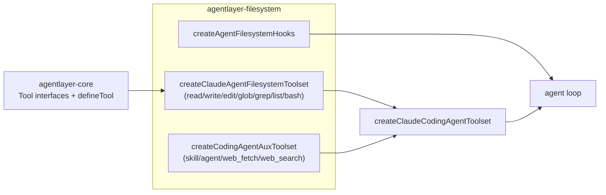

# @humanlayer/agentlayer-filesystem

Filesystem-backed implementations of `agentlayer-core`'s tool interfaces (read, write, edit, apply_patch, glob, grep, list, bash), plus the hooks and prompts needed to assemble a real coding agent that operates on a local directory. Where `agentlayer-core` defines *what* a tool is (schema + description via `ReadTool`, `EditTool`, etc.), this package provides the executors that actually touch disk and spawn processes.

## Install

```
bun add @humanlayer/agentlayer-filesystem
```

## Usage

Build a full Claude- or Codex-style toolset for a working directory in one call:

```ts
import { createClaudeCodingAgentToolset, createAgentFilesystemHooks, createAgentSystemPrompt } from '@humanlayer/agentlayer-filesystem'

const tools = await createClaudeCodingAgentToolset({ cwd: '/repo' })
// { bash, read, write, edit, glob, grep, list, skill, web_fetch, ... }

const hooks = createAgentFilesystemHooks({ cwd: '/repo' })
// { preToolUse, postToolUse, preRequest } — wasted-read prevention,
// read-before-write enforcement, output truncation, file-state tracking

const system = await createAgentSystemPrompt({ cwd: '/repo', model: 'claude-sonnet-4-5' })
```

`createCodexCodingAgentToolset` builds the Codex-flavored equivalent (`apply_patch` instead of `write`/`edit`). Both are composed from `createClaudeAgentFilesystemToolset` / `createCodexAgentFilesystemToolset` (filesystem tools only) plus `createCodingAgentAuxToolset` (skill, agent/subagents, web_fetch, web_search).

Individual tool factories are also exported for manual composition, e.g. `createReadTool({ cwd })`, `createBashTool({ cwd })`, `createGrepTool({ cwd })` — each returns a `Tool` built via `<Interface>.define(executor, { description })` from `@humanlayer/agentlayer-core/interfaces`.

## Subpath exports

- `.` — everything below
- `./tools` — tool factories (`createReadTool`, `createWriteTool`, `createEditTool`, `createApplyPatchTool`, `createGlobTool`, `createGrepTool`, `createListTool`, `createMultiEditTool`, `createReadMultimodalTool`, `createBashTool`, `createSkillToolFromDirs`/`createSkillToolFromRepoDirs`, `createWebSearchTool`)
- `./hooks` — `createAgentFilesystemHooks` and the pieces it's built from
- `./prompts` — `createAgentSystemPrompt`, `environmentPrompt`, `repoInstructionsPrompt`
- `./coding-agent` — the toolset/hooks composers shown above

## Key pieces

- **Tools** (`src/tools/`): each wraps Node's `fs/promises` (or `ripgrep`/`bash` subprocesses) behind the matching core `Tool` interface. `read`/`write`/`edit` resolve paths via `expandPath` (`~` and cwd-relative resolution). `grep` shells out to `ripgrep`, falling back to a JS-regex file walk (`fsGrepFallback`) if `rg` is unavailable. `glob`/`grep` cap results at 100 matches, most-recently-modified first.
- **Hooks** (`src/hooks/`): `createAgentFilesystemHooks({ cwd, outputTruncation? })` wires together:
  - `createWastedReadHook` / `createReadBeforeWriteHook` (pre-tool-use) — block re-reading unchanged file ranges and require a fresh read before `write`/`edit`/`apply_patch`, tracked via SHA-256 hashes in agent state.
  - `createFileStateTrackingHook` (post-tool-use) — records read/verification state after read/write/edit/apply_patch.
  - `create{Bash,Glob,Grep,List}OutputTruncationHook` + `createReadTruncationHook` — truncate large tool outputs and spill the full output to a temp file via `saveFullOutput`.
- **Prompts** (`src/prompts/`): `createAgentSystemPrompt` assembles `[persona, repoInstructions?, environment?, ...additions]` for a given model. `repoInstructionsPrompt` searches `CLAUDE.md`/`AGENTS.md`/`CONTEXT.md` (cwd, then git root) or layers multiple instruction sources via `instruction-resolver`. `environmentPrompt` reports cwd/platform/git-repo status.

## Toolset assembly



## Depends on

`@humanlayer/agentlayer-core` (tool interfaces, prompts, hooks primitives, utils) and the `ripgrep` npm package for `grep`.
