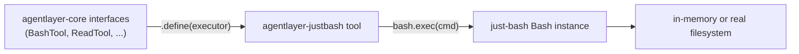

# agentlayer-justbash

Implements AgentLayer's core tool interfaces (`BashTool`, `ReadTool`, `WriteTool`, `EditTool`, `GrepTool`, `GlobTool`, `ListTool`, `ApplyPatchTool`, `WebFetchTool`, `WebSearchTool`, `CodeSearchTool`, skills) on top of [`just-bash`](https://github.com/vercel-labs/just-bash), Vercel's in-memory virtual bash environment. Every tool is a thin adapter: it shells out through a single `bash.exec()` call (`cat`, `rg`, `ls`, `curl`, heredocs, ...) instead of touching Node's `fs` directly, so agent tool use stays sandboxed to whatever filesystem `just-bash` is backed by.

## Install

```bash
bun add @humanlayer/agentlayer-justbash just-bash
```

`just-bash` and `typescript` are peer dependencies.

## Usage

```ts
import { Agent } from '@humanlayer/agentlayer-core'
import { Bash } from 'just-bash'
import { createJustBashTool, createJustBashReadTool, createWriteTool, createGrepTool } from '@humanlayer/agentlayer-justbash/tools'

const bash = new Bash()

const agent = new Agent({
	model /* an ai-sdk LanguageModel */,
	tools: {
		bash: createJustBashTool(bash),
		read: createJustBashReadTool(bash),
		write: createWriteTool(bash),
		grep: createGrepTool(bash),
	},
})
```

Tools that call external APIs take an options object with the key(s) they need:

```ts
import { createWebSearchTool, createCodeSearchTool } from '@humanlayer/agentlayer-justbash/tools'

const webSearch = createWebSearchTool(bash, { exaApiKey: process.env.EXA_API_KEY! })
const codeSearch = createCodeSearchTool(bash, { exaApiKey, context7ApiKey }) // at least one required
```

`createSkillToolFromVFS(bash, { dirs })` reads `*.md` skill files out of the virtual filesystem (parsing frontmatter `description` or the first `#` heading) and merges them with any statically-provided `skills`.

## Exports

- `.` — everything below, re-exported together
- `./tools` — the `create*Tool(bash, opts?)` factories listed above
- `./prompts` — `createAgentSystemPrompt`, `environmentPrompt`, `repoInstructionsPrompt`, plus re-exports of `@humanlayer/agentlayer-core/prompts` (`resolveCodingModelPrompt`, `detectModelFamily`, `tarsPersona`, etc.)

The prompt helpers use `bash.exec` (`git rev-parse --show-toplevel`, `cat`) instead of Node's `fs`/`child_process` to discover the repo root and read `CLAUDE.md`/`AGENTS.md`/`CONTEXT.md`, so they work identically whether `just-bash` is backed by a real disk or an in-memory VFS.

## Design

Each tool factory pairs a core tool interface (schema + name, from `@humanlayer/agentlayer-core/interfaces`) with an executor that drives `Bash.exec()`, and reuses the core's shared prompt text (`BASH_DESCRIPTION`, `READ_DESCRIPTION`, ...) so the tool description an agent sees is identical across backends (filesystem, justbash, etc.).



File-mutating tools (`write`, `edit`, `apply_patch`) write through shell heredocs (`cat > "$file" <<'DELIM' ... DELIM`) rather than direct file APIs, keeping all I/O funneled through the same `bash.exec` surface used for everything else.

## Tests

`bun run test` (see `test/`) covers the prompt-building helpers, `code-search` input validation, and `web-search` result shaping using a mocked `Bash.exec`.
