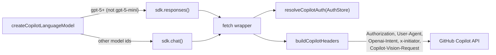

# @humanlayer/agentlayer-provider-github-copilot

An AI SDK v3 (`ProviderV3`/`LanguageModelV3`) provider that talks to the GitHub Copilot chat API. It handles Copilot's device-code OAuth flow, injects the Copilot-specific auth/User-Agent/intent headers on every request, and routes each model to either the Chat Completions or Responses API. Auth tokens are persisted through the `AuthStore` interface from `@humanlayer/agentlayer-provider-auth` (file-backed by default).

## Usage

```ts
import { createFileAuthStore } from '@humanlayer/agentlayer-provider-auth'
import { createCopilotProvider } from '@humanlayer/agentlayer-provider-github-copilot'
import { generateText } from 'ai'

const authStore = createFileAuthStore()
const copilot = createCopilotProvider({ authStore, version: 'my-agent' })

const result = await generateText({
	model: copilot.languageModel('gpt-4.1'),
	prompt: 'Say hello',
})
```

`createCopilotProvider` returns a `ProviderV3` — only `languageModel()` is implemented; `embeddingModel`/`imageModel`/`transcriptionModel`/`speechModel`/`rerankingModel` throw `NoSuchModelError`. Use `createCopilotLanguageModel({ authStore, modelId })` directly if you just need one model.

## Auth (device code flow)

```ts
import { startDeviceOAuth } from '@humanlayer/agentlayer-provider-github-copilot'

const auth = await startDeviceOAuth({ store: authStore }) // pass enterpriseUrl for GHE
console.log(`Visit ${auth.url} and enter code ${auth.userCode}`)
const result = await auth.complete() // polls until the user approves
```

`startDeviceOAuth` uses the hardcoded `COPILOT_CLIENT_ID` and writes an `OAuthAuthInfo` (with `enterpriseUrl` if set) into the given `AuthStore` under `COPILOT_PROVIDER_ID` ("github-copilot"). Tokens have no real expiry (`expiresAt: 0`); the stored `refreshToken` (falling back to `accessToken`) is sent as the bearer token on every request.

## Model discovery

```ts
import { listCopilotModels } from '@humanlayer/agentlayer-provider-github-copilot'

const models = await listCopilotModels({ authStore }) // CopilotModelMap keyed by model id
```

`listCopilotModels` hits `GET /models`, keeps only entries with `model_picker_enabled` and a non-`disabled` policy, and merges into an existing `CopilotModelMap` (pass `existing` to preserve locally-curated `name`/`family`/`options` overrides across refreshes).

## Request flow

Every outbound request goes through a `fetch` wrapper (`buildCopilotRequest`) that resolves auth, rewrites the URL to the Copilot (or enterprise) base URL, and sets headers before calling the real `fetch`:



`shouldUseCopilotResponsesApi(modelId)` picks the Responses API for `gpt-5*` models (excluding `gpt-5-mini`) and Chat Completions otherwise. `buildCopilotHeaders` also strips any caller-supplied `Authorization`/`x-api-key` headers, sets `x-initiator` to `agent` unless the last message is a real user turn (a synthetic `SYNTHETIC_ATTACHMENT_PROMPT` message does not count, so it still yields `agent`), and sets `Copilot-Vision-Request: true` when the request body contains an image part.

## Key exports (`src/index.ts`)

- `createCopilotProvider(options)`, `createCopilotLanguageModel(options)` — build the AI SDK provider/model.
- `createCopilotSdk(options)` / `createCopilotSdkSettings(options)` — lower-level access to the vendored OpenAI-compatible SDK (`src/sdk/copilot`).
- `buildCopilotRequest`, `buildCopilotHeaders`, `resolveCopilotAuth` — the auth/header plumbing, usable standalone.
- `listCopilotModels`, `getCopilotModels`, `copilotModelsResponseSchema` — model catalog fetch + zod schema.
- `startDeviceOAuth`, `writeCopilotOAuthTokens`, `normalizeEnterpriseUrl`, `getCopilotApiBaseUrl`, `getCopilotOAuthUrls` — OAuth device-code flow (`src/copilot-oauth.ts`).
- `shouldUseCopilotResponsesApi`, `COPILOT_PROVIDER` ("github-copilot"), `COPILOT_PROVIDER_ID`, `SYNTHETIC_ATTACHMENT_PROMPT`.
- Types: `CopilotAuthInfo`, `CopilotProviderOptions`, `CopilotLanguageModelOptions`, `CopilotHeadersResult`, `CopilotModelDefinition`, `CopilotModelMap`.

## Notes

- `src/sdk/copilot/**` is a vendored/trimmed fork of the AI SDK's `openai-compatible` provider (chat + responses language models). Per its own README it exists only to support the Copilot provider — avoid pulling in unrelated changes there.
- Run tests with `bun test` from this directory (or `bun run test` from the repo root). `test/copilot-real.test.ts` is `describe.skip`ped by default and only runs against a real Copilot auth file (`~/.humanlayer/agent-sdk/auth.json` or `AGENTLAYER_AGENT_SDK_AUTH_PATH`).
