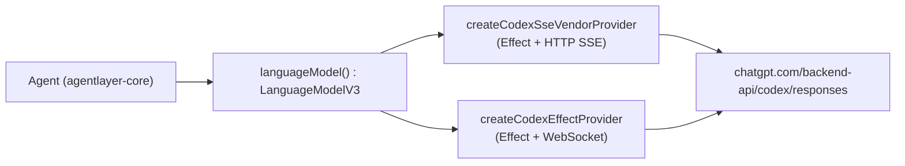

# agentlayer-provider-openai-codex

OpenAI Codex provider for AgentLayer and the AI SDK. It talks to the ChatGPT Codex responses endpoint (`https://chatgpt.com/backend-api/codex/responses`) and supports ChatGPT OAuth/API-key auth through `@humanlayer/agentlayer-provider-auth`. Every factory returns a standard `ProviderV3` (`@ai-sdk/provider`), so the resulting `languageModel()` works with `ai`'s `generateText`/`streamText` and with `Agent` from `@humanlayer/agentlayer-core`.

## Installation

```bash
bun add @humanlayer/agentlayer-provider-openai-codex @humanlayer/agentlayer-provider-auth
```

## Usage

```ts
import { Agent, startState, userMessage } from '@humanlayer/agentlayer-core'
import { createMemoryAuthStore } from '@humanlayer/agentlayer-provider-auth'
import { createCodexSseVendorProvider } from '@humanlayer/agentlayer-provider-openai-codex'

const codex = createCodexSseVendorProvider({
  authStore: createMemoryAuthStore({
    codex: { kind: 'oauth', accessToken: process.env.CODEX_ACCESS_TOKEN! },
  }),
})

const agent = new Agent({ model: codex.languageModel('gpt-5.4'), tools: {} })
const { state } = await agent.run({ state: startState([userMessage('Hello')]), stream: false }).result
```

## Providers

The package exports two provider factories with different transport tradeoffs; swap the import to change providers, everything else stays the same. (The hand-rolled `createCodexProvider` and the `@ai-sdk/openai`-delegating `createCodexResponsesProvider` were removed: the former had no runtime consumers, and the latter inherited upstream's usage schema, which drops GPT-5.6's `cache_write_tokens`.)

### 1. `createCodexSseVendorProvider` — Effect-based parser over HTTP SSE
Builds requests through the shared `LLMRequest` adapter (`./shared/adapter`) and streams via the vendored `@humanlayer/opencode-llm-vendor` `LLMClient` over HTTP SSE (`httpSseRoute`). Reports structured records to `diagnostics.onEvent` when configured.

### 2. `createCodexEffectProvider` — Effect-based parser over WebSocket
Same adapter/`LLMClient` pipeline as #1, but transports over a WebSocket connection (`webSocketRoute` + `WebSocketExecutor`) instead of HTTP SSE. Lives in `./providers/websockets-vendor-provider`.

```ts
import { createCodexEffectProvider, createCodexSseVendorProvider } from '@humanlayer/agentlayer-provider-openai-codex'

const codex = createCodexEffectProvider({ authStore, fastMode: true })
const model = codex.languageModel('codex-mini-latest')
```

All four accept the same base options (`CodexProviderOptions`):

```ts
interface CodexProviderOptions {
  authStore?: AuthStore                  // OAuth/API-key store (default: file-based)
  providerId?: string                    // Key in the auth store (default: 'codex')
  fetch?: CodexFetchLike
  version?: string                       // Codex CLI version reported in User-Agent
  sessionId?: string
  now?: () => number                     // Clock override for token expiry checks
  fastMode?: boolean                     // Send service_tier: "priority"
  serviceTier?: string | null            // Explicit service tier
  diagnostics?: CodexDiagnosticsContext  // Structured event sink: { annotations, onEvent(record) }
}
```

`createCodexResponsesProvider` additionally accepts `chunkTimeout`/`headerTimeout` (ms; default `120000`/`10000`, pass `false` to disable). The vendor-backed providers (`createCodexSseVendorProvider`, `createCodexEffectProvider`) use fixed internal stream timeouts and don't expose these as options.

## Fast mode & service tier

`fastMode: true` sends `service_tier: "priority"`, matching the Codex CLI's fast-mode request behavior. Override per request via `providerOptions`:

```ts
await model.doStream({
  prompt: [{ role: 'user', content: [{ type: 'text', text: 'Ship this quickly.' }] }],
  providerOptions: { openai: { serviceTier: 'fast' } }, // normalized to "priority"
})
```

`serviceTier` takes precedence over `fastMode`, and `"fast"` is always normalized to `"priority"` (`normalizeCodexServiceTier`). Both providers read options from `providerOptions.openai`.

## Architecture



## Other exports

- `resolveCodexAuth`, `buildCodexUserAgent` (`./shared/auth`) — refresh expired OAuth tokens against the `AuthStore`.
- OAuth device/browser flow: `startDeviceOAuth`, `startBrowserOAuth`, `exchangeCodeForTokens`, `refreshAccessToken`, `buildAuthorizeUrl`, `generatePKCE` (`./oauth`).
- `normalizeCodexServiceTier`, `CODEX_API_ENDPOINT`, `CODEX_PROVIDER_ID`, `CODEX_DEFAULT_VERSION`, `CODEX_FAST_SERVICE_TIER`, `CODEX_FLEX_SERVICE_TIER` — shared constants (`./shared/constants`).
- `parseJwtClaims`, `extractAccountId` (`./jwt`) — decode ChatGPT account id out of OAuth id/access tokens.
