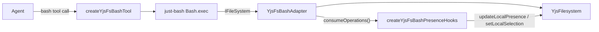

# @humanlayer/agentlayer-yjs-fs-justbash

A `bash` tool for AgentLayer agents that executes commands against a [`YjsFilesystem`](../yjs-fs) instead of the real OS filesystem, using [`just-bash`](https://github.com/vercel-labs/just-bash) as the shell interpreter. Every file read/write/mkdir/rm/cp/mv the shell performs goes through the CRDT-backed `yjs-fs`, so bash commands run by an agent participate in the same collaborative document as other AgentLayer filesystem tools.

## Install

```
bun add @humanlayer/agentlayer-yjs-fs-justbash @humanlayer/yjs-fs just-bash
```

`@humanlayer/yjs-fs` and `just-bash` are peer dependencies.

## Usage

```ts
import { YjsFilesystem } from '@humanlayer/yjs-fs'
import { createYjsFsBashTool, createYjsFsBashPresenceHooks } from '@humanlayer/agentlayer-yjs-fs-justbash'
import { Agent } from '@humanlayer/agentlayer-core'

const fs = new YjsFilesystem()
const bash = createYjsFsBashTool(fs, { cwd: '/' })

const agent = new Agent({
  model,
  tools: { bash },
  hooks: { postToolUse: createYjsFsBashPresenceHooks(fs) },
})
```

The tool's `execute` returns `{ output, operations }`: `output` is the truncated `Exit code: N\n<stdout>[\nSTDERR: ...]` string sent back to the model, and `operations` is the list of filesystem operations (`read`/`write`/`append`/`list`/`mkdir`/`delete`/`copy`/`move`) the command performed, recorded for the presence hook.

## Key exports

- `createYjsFsBashTool(fs, opts?)` (`./tools`) — builds the `bash` `defineTool` (name `'bash'`, `input: bashInput`, description `BASH_DESCRIPTION` from `agentlayer-core/prompts`). `opts.bashOptions` is passed through to `just-bash`'s `Bash` constructor (minus `fs`/`cwd`, which are fixed to the adapter and `opts.cwd`).
- `createYjsFsBashPresenceHooks(fs, opts?)` (`./hooks`) — a `postToolUse` hook (matches `BashTool`) that updates yjs awareness/presence (`currentFile`, `action`, `bashOperation(s)`) after each bash call and sets a fading text selection (`opts.selectionFadeMs`, default 5000ms) on the most-recently-touched file. No-ops silently if the doc has no awareness.
- `YjsFsBashAdapter` (`./src/adapter.ts`) — implements just-bash's `IFileSystem` on top of a `YjsFilesystem`. Tracks every operation performed since the last `consumeOperations()` call; unsupported ops (`chmod`, `symlink`, `link`, `readlink`) throw `ENOTSUP`.
- `YjsFsBashOperation` / `YjsFsBashOperationType` — the recorded-operation shape (`type`, `path`, `toPath?`, `pathType?`).

## How it fits together



## Testing

Uses shared test mocks from `../agentlayer-yjs-fs/test/mocks` (`makeToolContext`, `mockModel`, etc.). Run with `bun run test` from the repo root, or `bun test` from this directory.
