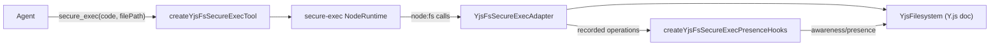

# agentlayer-yjs-fs-secure-exec

Bridges [`@humanlayer/yjs-fs`](../yjs-fs) (a Y.js CRDT filesystem) into [`secure-exec`](https://github.com/vercel-labs/secure-exec)'s sandboxed Node runtime, and exposes it as an `agentlayer-core` tool. Code the agent runs inside the sandbox reads/writes through `node:fs` as usual, but every operation is actually applied to the collaborative Y.js document — so filesystem edits made by sandboxed code stay in sync with other collaborators/editors.

## Install

```bash
bun add @humanlayer/agentlayer-yjs-fs-secure-exec @humanlayer/yjs-fs secure-exec
```

`@humanlayer/yjs-fs` and `secure-exec` are peer dependencies.

## Usage

```ts
import { YjsFilesystem } from '@humanlayer/yjs-fs'
import { createYjsFsSecureExecTool } from '@humanlayer/agentlayer-yjs-fs-secure-exec/tools'

const fs = new YjsFilesystem()
fs.createFile('/input.txt', 'hello')

const tool = createYjsFsSecureExecTool(fs)

const raw = await tool.execute(
	{
		code: `import { readFileSync, writeFileSync } from 'node:fs'
writeFileSync('/output.txt', readFileSync('/input.txt', 'utf8') + ' world')
export const ok = true`,
		filePath: '/entry.mjs',
	},
	{} as never,
)

fs.readFile('/output.txt') // 'hello world'
raw.operations // [{ type: 'read', path: '/input.txt', ... }, { type: 'write', path: '/output.txt', ... }]
```

Wire the tool into an `Agent` (from `@humanlayer/agentlayer-core`) as `tools: { secure_exec: tool }`.

## Key exports

- `createYjsFsSecureExecTool(fs, opts?)` (from `./tools`) — builds the `secure_exec` `defineTool` tool. Input is `{ code, filePath? }` (`filePath` defaults to `/entry.mjs`); output is `{ output, operations }`, where `output` is the truncated JSON-stringified `secure-exec` run result and `operations` is the list of filesystem ops the code performed.
- `createYjsFsRuntime(fs, opts?)` (from `./runtime` / root) — lower-level helper that builds a `secure-exec` `NodeRuntime` wired to a `YjsFsSecureExecAdapter`. Returns `{ runtime, adapter }`. Options: `permissions` (merged over `allowAllFs`), `enableNetwork` (turns on `secure-exec`'s network adapter + `allowAllNetwork`), `loopbackExemptPorts`, `moduleAccessCwd` (exposes a host directory's `node_modules` read-only for module resolution inside the sandbox).
- `YjsFsSecureExecAdapter` (from `./adapter` / root) — implements `secure-exec`'s `VirtualFileSystem` interface on top of a `YjsFilesystem`. Records every call (`read`/`write`/`list`/`mkdir`/`delete`/`rename`/`truncate`) as a `YjsFsSecureExecOperation`; drain them with `adapter.consumeOperations()`. `symlink`/`readlink`/`link`/`chmod`/`chown` throw `ENOTSUP` since `YjsFilesystem` doesn't model them.
- `createYjsFsSecureExecPresenceHooks(fs, opts?)` (from `./hooks`) — a `postToolUse` hook (for `Agent`'s `hooks.postToolUse`) that publishes the most relevant tracked operation to `fs`'s Y.js awareness/presence (`currentFile`, `action`, `secureExecOperation(s)`) and briefly selects the touched file's full text range, fading the selection after `selectionFadeMs` (default 5000ms).

## How it fits together



## Tests

`test/adapter.test.ts` covers the `VirtualFileSystem` mapping directly; `test/runtime.test.ts` covers running real code through `createYjsFsRuntime`/`createYjsFsSecureExecTool` (including network access via `enableNetwork` and host `node_modules` overlay via `moduleAccessCwd`); `test/presence-hooks.test.ts` exercises the hook end-to-end via a full `Agent` run.
