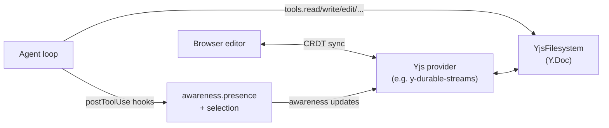

# @humanlayer/agentlayer-yjs-fs

Yjs-backed implementations of `agentlayer-core`'s filesystem tool interfaces (`read`, `write`, `edit`, `apply_patch`, `glob`, `grep`, `list`), executing against `@humanlayer/yjs-fs`'s `YjsFilesystem` — a CRDT virtual filesystem — instead of disk. Because the filesystem is a Y.Doc, edits an agent makes merge automatically with edits from a browser editor (or another agent) sharing the same document, and a set of post-tool-use hooks broadcast "who is touching what" via Yjs awareness so collaborators can see live cursors/selections.

## Install

```
bun add @humanlayer/agentlayer-yjs-fs @humanlayer/yjs-fs
```

## Usage

The quickest path is `createYjsFsToolset`, which builds (or wraps) a `YjsFilesystem` and returns tools + presence hooks bound to it:

```ts
import { createYjsFsToolset } from '@humanlayer/agentlayer-yjs-fs'
import { Agent, startState } from '@humanlayer/agentlayer-core'

// pass { doc, awareness } to bind to an existing Y.Doc/Awareness, or { fs }
// to reuse a YjsFilesystem you already constructed; omit both to create one.
const toolset = createYjsFsToolset({ doc, awareness })

const agent = new Agent({
  model,
  tools: toolset.tools, // { read, write, edit, apply_patch, glob, grep, list }
  hooks: toolset.hooks, // { postToolUse: [...presence hooks] }
})

await agent.run({ state: startState([{ role: 'user', content: 'read it' }]) }).result
```

`createYjsFsToolset` does not create, connect, or await a Yjs provider — sync `doc`/`awareness` (e.g. with `@durable-streams/y-durable-streams`'s `YjsProvider`) before or while the tools run.

Individual pieces are available via subpath exports for manual composition:

```ts
import { createYjsFsReadTool, createYjsFsWriteTool } from '@humanlayer/agentlayer-yjs-fs/tools'
import { createYjsFsPresenceHooks } from '@humanlayer/agentlayer-yjs-fs/hooks'
```

## Key exports

- `createYjsFsToolset(opts?)` (`.`) — `{ fs, tools, hooks }`. `opts` is either `{ fs }` or `{ doc?, awareness? }` plus optional `presence` options.
- `./tools` — `createYjsFsReadTool`, `createYjsFsWriteTool`, `createYjsFsEditTool`, `createYjsFsApplyPatchTool(fs, { cwd? })`, `createYjsFsGlobTool`, `createYjsFsGrepTool`, `createYjsFsListTool` — each takes a `YjsFilesystem` and returns a `Tool` built via `<Interface>.define(executor, { description })` from `@humanlayer/agentlayer-core/interfaces`, using the shared prompt strings from `@humanlayer/agentlayer-core/prompts`.
- `./hooks` — `createYjsFsPresenceHooks(fs, { selectionFadeMs? })` returns `PostToolUseHook[]` for read/edit/write/apply_patch/delete. After each call it writes `awareness.getLocalState().presence` (`{ currentFile, action, editResult? }`) via `fs.updateLocalPresence`. read/edit/write/apply_patch also highlight the affected range with `fs.setLocalSelection`, clearing it after `selectionFadeMs` (default `5000`); delete instead clears any existing selection immediately via `fs.clearLocalSelection`. All awareness calls are no-ops (swallowed) when no `Awareness` is attached, so hooks are safe to use headlessly.
- `write`/`apply_patch` create missing parent directories automatically (`fs.mkdir`) before writing.
- `glob`/`grep`/`list` walk the CRDT tree via `fs.tree()`/`fs.list()` and match with `minimatch` (`src/utils/tree.ts`); `glob`/`grep` results are capped at 100 matches, `list` returns all non-ignored entries in the target directory.

## Collaboration model



Because `YjsFilesystem` is CRDT-backed, an agent's `write`/`edit`/`apply_patch` calls and a human's concurrent edits in a synced browser editor converge without conflict (see `test/catalog-race.test.ts` for a durable-streams round-trip example). This package only wires tool executors and presence hooks to that filesystem — it depends on `@humanlayer/yjs-fs` (peer dependency) for the CRDT implementation itself and on `@humanlayer/agentlayer-core` for tool/hook interfaces.
