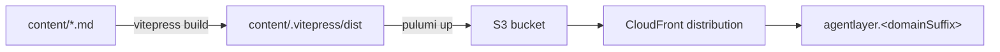

# @humanlayer/agentlayer-docs

The VitePress documentation site for AgentLayer, published at `agentlayer.<domain>`. Content lives in `content/` as Markdown; deployment infrastructure (S3 + CloudFront) is defined as Pulumi code in `pulumi.ts`.

This package is `private` — it is not published to npm.

## Development

```bash
bun install
bun run --cwd packages/docs dev      # vitepress dev content
bun run --cwd packages/docs build    # vitepress build content -> content/.vitepress/dist
bun run --cwd packages/docs preview  # serve the production build locally
```

From the repo root, `bun run docs:build` runs the same build via Bun's `--filter`.

## Structure

```
content/
  index.md                  # landing page / quickstart
  introduction/              # motivation, architecture
  concepts/                  # tools, hooks, run API, streaming, state, subagents
  packages/
    core/                    # agentlayer-core reference (agent, hooks, prompts, tool interfaces...)
    filesystem/              # agentlayer-filesystem reference
    justbash/                # agentlayer-justbash reference
    openai-codex/             # agentlayer-provider-openai-codex reference
  guides/                    # first-agent, custom-tools, hook-patterns, multi-model
  .vitepress/
    config.ts                # site title, nav, sidebar, markdown/mermaid config
    theme/                   # custom theme entry + styles
```

Sidebar navigation, nav links, and search config are all defined in `content/.vitepress/config.ts`. It wraps VitePress's `defineConfig` with `withMermaid` (from `vitepress-plugin-mermaid`) so pages can embed \`\`\`mermaid diagrams, and registers `vitepress-plugin-llms` to emit an `llms.txt` for the built site.

Adding a page means creating the `.md` file under `content/` and adding a matching entry to the `sidebar` array in `config.ts` — VitePress does not auto-discover pages for navigation.

## Deployment

`pulumi.ts` (Pulumi program, `packagemanager: bun` per `Pulumi.yaml`) builds the site (`bun run docs:build`), uploads `content/.vitepress/dist` to an S3 bucket, and serves it through a CloudFront distribution with an ACM cert and Route53 alias sourced from the `humanlayer/core/prod` stack reference. Deploy with:

```bash
bun run --cwd packages/docs pulumi:preview
bun run --cwd packages/docs pulumi:up
```

Both target the `humanlayer/agentlayer-docs/prod` Pulumi stack (config in `Pulumi.prod.yaml`).


