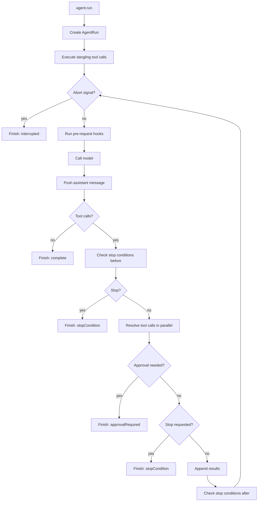
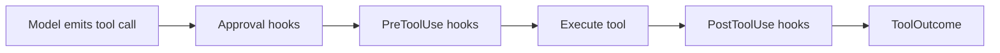

# Architecture

This page describes how AgentLayer works internally — the agent loop, tool resolution pipeline, streaming model, and state management.

## Agent Loop Overview

When you call `agent.run(options)`, a loop executes:



Each iteration is one **step**: call the model, execute tools, check conditions.

### The Preamble: Dangling Tool Calls

When resuming from a previous run, the message history might end with tool calls that never executed. This happens when:

- A run paused for approval
- `maxSteps` was hit mid-execution
- A sub-agent paused

The preamble handles these dangling calls before the main loop starts.

::: info Source Reference
See [`executeDanglingToolCalls()`](https://github.com/humanlayer/agentlayer/blob/main/packages/agentlayer-core/src/agent.ts#L1223-L1460) in `agent.ts`.
:::

## Tool Resolution Pipeline

Every tool call passes through a multi-stage pipeline. Each stage can short-circuit:



### Hook Chain Behavior

- **Approval hooks**: Short-circuit on first non-`next()` result
- **PreToolUse hooks**: Short-circuit on `toolResult()` or `stop()`
- **PostToolUse hooks**: Always run all hooks, threading output forward
- **PreRequest hooks**: Always run all hooks, threading messages forward

### Parallel Tool Calls

When the model generates multiple tool calls in one step, they resolve in parallel. Each call independently goes through the full pipeline. Outcomes are then classified:

| Outcome | When | What Happens |
|---------|------|--------------|
| `executed` | Tool ran | Result appended to context |
| `denied` | Approval hook returned `deny()` | Denial message appended |
| `toolResult` | PreToolUse hook returned synthetic output | Tool never executed |
| `ask` | Approval hook returned `ask()` | Run pauses for approval |
| `hookStop` | PreToolUse hook returned `stop()` | Loop finishes |

::: info Source Reference
See [`resolveToolCall()`](https://github.com/humanlayer/agentlayer/blob/main/packages/agentlayer-core/src/agent.ts#L914-L1066) and the `ToolOutcome` type in `agent.ts`.
:::

## Streaming Model

`AgentRun` implements `AsyncIterable<AgentEvent>`. You can stream events while awaiting the final result.

### Event Types

```ts
type AgentEvent =
  // Complete messages
  | { type: 'message'; message: ModelMessage }
  
  // Approval requests
  | { type: 'approvalRequested'; approval: ApprovalRequest; toolCallId: string; toolName: string; input: Record<string, unknown> }
  
  // Token usage per model call
  | { type: 'tokenUsage'; usage: TokenUsageEvent }
  
  // Step boundaries
  | { type: 'stepStart'; stepIndex: number }
  | { type: 'stepFinish'; stepIndex: number; finishReason?: string }
  
  // Streaming text
  | { type: 'textStart'; id: string; stepIndex: number }
  | { type: 'textDelta'; id: string; text: string; stepIndex: number }
  | { type: 'textEnd'; id: string; stepIndex: number }
  
  // Streaming tool input
  | { type: 'toolInputStart'; id: string; toolName: string; stepIndex: number }
  | { type: 'toolInputDelta'; id: string; delta: string; stepIndex: number }
  | { type: 'toolInputEnd'; id: string; stepIndex: number }
  
  // Streaming reasoning (for models with extended thinking)
  | { type: 'reasoningStart'; id: string; stepIndex: number }
  | { type: 'reasoningDelta'; id: string; text: string; stepIndex: number }
  | { type: 'reasoningEnd'; id: string; stepIndex: number }
```

### Push/Pull Buffer

`AgentRun` uses a push/pull buffer model internally. Events are pushed by the loop and pulled by consumers via the async iterator.

::: info Source Reference
See [`AgentRun`](https://github.com/humanlayer/agentlayer/blob/main/packages/agentlayer-core/src/agent-run.ts) for the full implementation.
:::

## Context Window Updates

Tools can modify the context window in two ways:

### 1. Deferred Updates via `updateContextWindow()`

Tools queue transforms that apply after their result is committed:

```ts
execute: async (input, ctx) => {
  ctx.updateContextWindow((messages) => [
    ...messages,
    { role: 'user', content: 'Follow-up instruction from tool' },
  ])
  return 'tool output'
}
```

### 2. PreToolUse Hook Mutations

Hooks can mutate tool inputs and optionally patch the context window so the model sees updated values:

```ts
return ctx.next(
  { ...ctx.input, command: normalizedCommand },
  { updateContextWindow: true, notifyModel: true }
)
```

- `updateContextWindow: true` — Patches the assistant message's tool-call input
- `notifyModel: true` — Prepends a system note to the tool result explaining the mutation

## State Model

`AgentState` is designed for serialization:

```ts
interface AgentState {
  messages: ModelMessage[]
  pendingToolCalls?: PendingToolCall[]
  approvalHistory?: ApprovalHistoryEntry[]
  toolState?: Record<string, unknown>
  subAgents?: Record<string, AgentState>
  contextWindowTokens?: number
}
```

| Field | Purpose |
|-------|---------|
| `messages` | The conversation history |
| `pendingToolCalls` | Tool calls awaiting approval or stopped |
| `approvalHistory` | Past approval decisions |
| `toolState` | Persistent KV state for tools and hooks |
| `subAgents` | Nested child agent states |
| `contextWindowTokens` | Estimated token count |

The recursive `subAgents` structure enables nested pause/resume at arbitrary depth.

::: info Source Reference
See [`AgentState`](https://github.com/humanlayer/agentlayer/blob/main/packages/agentlayer-core/src/state.ts#L56-L71) in `state.ts`.
:::

## Interface vs Implementation

This split is fundamental:

**Interfaces** define what the model sees:
- Input schema
- Description
- Serialization behavior

**Implementations** define how work happens:
- Local filesystem
- Sandboxed runtime
- Remote service
- Custom backend

The same interface can be backed by different implementations without changing what the model is told.

```ts
// Interface (shared)
const ReadTool = defineToolInterface({
  name: 'read',
  description: 'Read a file',
  input: z.object({ filePath: z.string() }),
  output: z.string(),
})

// Implementation A: Local disk
const localRead = ReadTool.define(async (input) => {
  return await Bun.file(input.filePath).text()
})

// Implementation B: S3
const s3Read = ReadTool.define(async (input) => {
  return await s3.getObject({ Key: input.filePath }).then(r => r.Body.transformToString())
})
```

::: info Source Reference
See [`defineToolInterface()`](https://github.com/humanlayer/agentlayer/blob/main/packages/agentlayer-core/src/define-tool.ts#L252-L313) in `define-tool.ts`.
:::

## Finish Reasons

When the loop ends, `RunResult.finishReason` indicates why:

| Reason | Cause |
|--------|-------|
| `complete` | Model returned without tool calls |
| `maxSteps` | Step limit reached |
| `stopCondition` | A stop condition fired |
| `interrupted` | Abort signal triggered |
| `approvalRequired` | Tool needs approval |
| `error` | An error occurred |

## Next Steps

- **[Tools](/concepts/tools)** — Deep dive into defining and implementing tools
- **[Hooks](/concepts/hooks)** — Intercept and transform at every stage
- **[State](/concepts/state)** — Serialization, persistence, and resume patterns
- **[Run API](/concepts/run-api)** — Control the loop and handle results
