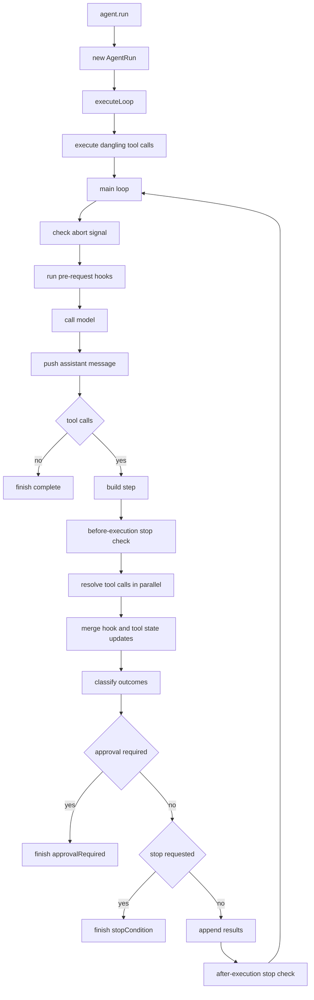
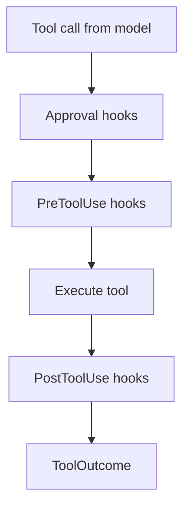

# Architecture

This page describes the internal architecture of AgentLayer -- how the loop runs, how tool calls are resolved through hooks, how streaming works, and how errors are handled.

## Agent Loop Lifecycle

When you call `agent.run(options)`, the following sequence occurs:



### The Preamble: `executeDanglingToolCalls`

When resuming from a previous run, the message history may end with an assistant message that has tool calls but no corresponding tool-result messages. This happens when a prior run paused for approval, hit a step limit mid-execution, or paused inside a sub-agent flow.

The preamble handles those dangling calls before the main loop starts.

### The Main Loop

Each iteration of the main loop is one step:

1. check abort state
2. run pre-request hooks
3. call the model
4. push assistant messages
5. inspect tool calls
6. build a step record
7. evaluate before-execution stop conditions
8. resolve tool calls
9. apply mutations and merge state updates
10. evaluate after-execution stop conditions

## Tool Resolution Pipeline

Every tool call passes through a multi-stage pipeline. Each stage can short-circuit the pipeline.



### Hook chain semantics

All hook types use the same chain pattern:

- hooks run in array order
- approval and pre-tool hooks short-circuit on the first non-`next()` result
- post-tool hooks thread mutated output forward
- hook state is accumulated across the chain and merged after execution

### Parallel tool calls

When the model generates multiple tool calls in one step, they are resolved in parallel. Each call independently goes through the full pipeline. The outcomes are then classified and routed.

## ToolOutcome

After resolution, every tool call produces a `ToolOutcome`:

| Kind | When | What happens |
|---|---|---|
| `executed` | Tool ran successfully or with error | Result message appended to context window |
| `denied` | Approval hook returned `deny()` | Denial message appended as the tool result |
| `toolResult` | PreToolUse hook returned synthetic output | Tool never executed |
| `ask` | Approval hook returned `ask()` | Run pauses for approval |
| `hookStop` | PreToolUse hook returned `stop()` | Loop finishes |

## AgentRun Streaming Model

`AgentRun` implements `AsyncIterable<AgentEvent>` using a push/pull buffer model.

You can stream events while also awaiting the final result.

### Event types

```ts
type AgentEvent =
  | { type: 'message'; message: ModelMessage; agentId?: string; parentToolCallId?: string }
  | { type: 'approvalRequested'; approval: ApprovalRequest; toolCallId: string; toolName: string; input: Record<string, unknown>; agentId?: string; parentToolCallId?: string }
  | { type: 'tokenUsage'; usage: TokenUsageEvent; agentId?: string; parentToolCallId?: string }
```

## Context Window Updates

Tools can queue deferred transforms to the message array via `ctx.updateContextWindow(callback)`. These transforms are applied after the tool's result message has been committed to the conversation.

PreToolUse hooks can also mutate tool-call inputs and patch the context window so the model sees the updated values.

## Contracts vs Implementations

This is the key split in the architecture.

Tool interfaces define what the model sees:

- input schema
- description
- serialization behavior

Tool implementations define how work actually happens.

That means the same model-facing tool interface can be backed by:

- the local filesystem
- a sandboxed bash runtime
- your own custom backend

## State Model

`AgentState` is designed to be serializable.

It includes:

- messages
- pending tool calls
- approval history
- tool KV state
- sub-agent state

This lets you pause a run, store the state anywhere, and resume it later without depending on a local on-disk database.
