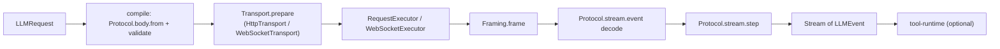

# opencode-llm-vendor

An [Effect](https://effect.website)-based LLM client vendored from [opencode](https://github.com/sst/opencode). It turns a single provider-agnostic `LLMRequest` into a streamed sequence of `LLMEvent`s over HTTP (SSE) or WebSocket, with retries, timeouts, redacted diagnostics, and typed tool orchestration built in. `agentlayer-provider-openai-codex` is the primary consumer, wrapping it in an `@ai-sdk/provider` `LanguageModelV3`.

Most files under `src/` carry `// @ts-nocheck — vendored from opencode, tested upstream under different tsconfig`: they are kept close to the upstream source and are typechecked (and tested) in opencode itself, not here.

## Install / usage

```ts
import { route } from '@humanlayer/opencode-llm-vendor/protocols/openai-responses'
import { Auth } from '@humanlayer/opencode-llm-vendor/route/auth'
import { LLMClient } from '@humanlayer/opencode-llm-vendor/route/client'
import { RequestExecutor } from '@humanlayer/opencode-llm-vendor/route/executor'
import { LLMRequest, Message, Model } from '@humanlayer/opencode-llm-vendor/schema'
import { Effect, Layer, Stream } from 'effect'

const model = Model.make({
  id: 'gpt-4.1',
  provider: 'openai',
  route: route.with({ auth: Auth.bearer(process.env.OPENAI_API_KEY!) }),
})

const request = new LLMRequest({
  model,
  system: [],
  messages: [Message.user('hi')],
  tools: [],
})

const layers = LLMClient.layer.pipe(Layer.provide(RequestExecutor.defaultLayer))

await Effect.runPromise(
  LLMClient.stream(request).pipe(
    Stream.runForEach((event) => Effect.log(event)),
    Effect.provide(layers),
  ),
)
```

`LLMClient.generate(request)` collects the stream into a single `LLMResponse`. Passing `{ request, tools }` (typed `Tool.make(...)` definitions from `./tool`) instead of a bare request runs the built-in tool loop (`./tool-runtime`), executing tool calls and feeding results back until `stopWhen` (e.g. `LLMClient.stepCountIs(n)`) is satisfied.

## Concepts

A deployment (`Route`, from `./route`) is composed of four orthogonal pieces:

- **Protocol** (`./route/protocol`) — the wire contract: builds/validates the provider-native request body and decodes streamed frames into `LLMEvent`s. `./protocols/openai-responses` is the only concrete protocol currently vendored (HTTP SSE `route` and `webSocketRoute`).
- **Endpoint** (`./route/endpoint`) — base URL + path (string or function of the request/body).
- **Auth** (`./route/auth`) — composable header injection (`Auth.bearer`, `Auth.headers`, `Auth.andThen`, `Auth.orElse`, `Config`-backed credentials).
- **Framing** (`./route/framing`) — cuts the raw byte stream into protocol frames (`Framing.sse` for SSE; WebSocket routes frame differently, see `./route/transport/websocket`).

`Route.make({ id, protocol, endpoint, auth, framing, defaults })` builds an HTTP route; `route.with({ auth, endpoint, stream })` patches an existing route (e.g. to point at a different host or add stream timeouts) without mutating it. `Model.make({ id, provider, route })` binds a route to a specific model id for use in an `LLMRequest`.



`LLMClient.layer` (`./route/client`) requires `RequestExecutor.Service` (`./route/executor`, HTTP client with redaction, retries, rate-limit parsing) and optionally `WebSocketExecutor.Service` / `LLMDiagnostics.Service` (`./route/diagnostics`, structured event sink — defaults to `noopLayer`).

## Key exports (see `package.json#exports`)

- `./schema` — `LLMRequest`, `Message`, `Model`, `ToolDefinition`, `LLMEvent`, `LLMError` and its typed `reason` taxonomy (rate limit, auth, content policy, transport, ...).
- `./route`, `./route/client` — `LLMClient` (`layer`, `stream`, `generate`, `prepare`), `Route`.
- `./route/auth` — `Auth` combinators and credential sources (`Auth.value`, `Auth.config`, `Auth.bearer`).
- `./route/executor` — `RequestExecutor` (`defaultLayer` = fetch-backed).
- `./route/transport`, `./route/transport/http`, `./route/transport/websocket` — `HttpTransport`, `WebSocketTransport`, `WebSocketExecutor`.
- `./route/diagnostics` — `LLMDiagnostics`, `noopDiagnostics`, `llmErrorMetadata` for structured error logging.
- `./tool` — `Tool.make(...)` for typed or JSON-Schema-based tool definitions.
- `./tool-runtime` — `stream`/`RunOptions` powering the multi-step tool loop; `LLMClient.stepCountIs` is built from this module.

`src/cache-policy.ts` (not re-exported, used internally by `LLMClient`) auto-places prompt-cache breakpoints (tools / system / latest user message) for protocols that respect inline cache hints (currently `anthropic-messages`, `bedrock-converse`), configurable per-request via `LLMRequest.cache`.

## Tests

This package has no local tests; its behavior is exercised through the consumer package's suite, e.g. `packages/agentlayer-provider-openai-codex/test/vendor-exports-smoke.test.ts` and `codex-effect-provider.test.ts`.
