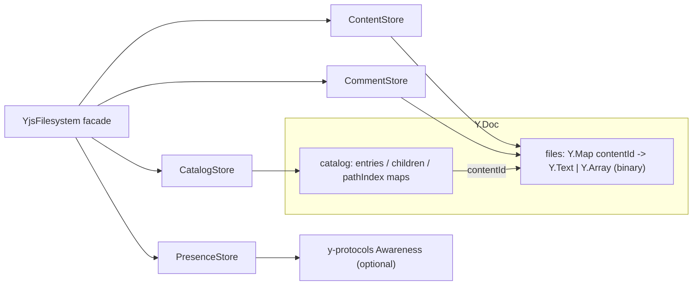

# @humanlayer/yjs-fs

A transport-neutral, CRDT-backed virtual filesystem for collaborative coding agents, built on [Yjs](https://github.com/yjs/yjs). A single `Y.Doc` stores a full directory namespace (files, directories, stable ids) plus per-file text/binary content, comments, and live-cursor presence — so multiple agents/humans can read and edit the same tree concurrently and converge automatically, with no server-side merge logic required. It is the storage layer underneath `@humanlayer/agentlayer-yjs-fs` (and its `-justbash`/`-secure-exec` variants), which adapt it to `agentlayer-core`'s tool interfaces.

## Install

```
bun add @humanlayer/yjs-fs yjs y-protocols
```

`yjs`, `y-protocols`, and `lib0` are peer dependencies — bring your own Yjs version and sync provider (e.g. `y-websocket`, `@durable-streams/y-durable-streams`).

## Usage

```ts
import { YjsFilesystem } from '@humanlayer/yjs-fs'

const fs = new YjsFilesystem() // wraps a fresh Y.Doc by default

fs.mkdir('/workspace')
fs.createFile('/workspace/notes.txt', 'hello world')

fs.readFile('/workspace/notes.txt') // 'hello world'
fs.editFile('/workspace/notes.txt', 'world', 'yjs') // unique substring replace
fs.rename('/workspace/notes.txt', '/workspace/renamed.txt')
fs.list('/workspace') // EntryDirent[]
fs.unlink('/workspace/renamed.txt')
```

For a shared/provider-backed doc, connect and sync the provider *before* constructing `YjsFilesystem` — construction initializes catalog state for empty docs, which can race with remote hydration otherwise:

```ts
await provider.connect()
await waitForProviderSync(provider)
const fs = new YjsFilesystem({ doc: provider.doc, awareness })
```

Two independent docs converge with plain Yjs updates:

```ts
import * as Y from 'yjs'

Y.applyUpdate(doc2, Y.encodeStateAsUpdate(doc1))
```

## Key exports

- `YjsFilesystem` — the path-oriented facade: `lookup`, `stat`, `list`, `tree`, `exists`, `subscribe`/`subscribePath`, `mkdir`, `createFile`/`createBinaryFile`, `readFile`/`readBinaryFile`, `writeFile`/`writeBinaryFile`, `editFile` (unique substring replace, returns `EditResult`), `getYTextForFile`/`getYText` (raw `Y.Text` for editor bindings), `rename`, `unlink`, plus comment (`addComment`, `getComments`, `replyToComment`, `resolveComment`) and presence (`setLocalPresence`, `updateLocalPresence`, `setLocalSelection`, `getLocalSelection`) methods.
- `CatalogStore`, `ContentStore`, `CommentStore`, `PresenceStore` — the lower-level stores `YjsFilesystem` composes; exported for callers that need direct access.
- Types: `EntryId`, `ContentId`, `EntryType`, `DirectoryEntry`, `FileEntry`, `EntryMetadata`, `LookupResult`, `EntryDirent`, `FilesystemTreeNode`, `EntryStat`, `EditResult`, `CommentAnchor`, `CommentReply`, `FileComment`.
- Errors (all extend `YjsFsError` with a `.code`): `AlreadyExistsError`, `EntryNotFoundError`, `InvalidPathError`, `NotDirectoryError`, `NotFileError`, `NotBinaryFileError`, `NotTextFileError`, `DirectoryNotEmptyError`, `RootMutationError`.
- `@humanlayer/yjs-fs/presence` subpath — standalone awareness helpers (`getLocalPresenceState`, `setLocalPresenceState`, `updateLocalPresenceState`, `setLocalSelection`, `getLocalSelection`, `resolveLocalSelectionState`, `colorFromId`) usable without a `YjsFilesystem` instance.

## Architecture

The catalog (namespace metadata) and file content are stored as separate, independently syncable structures in the same `Y.Doc`, linked by stable `contentId`s. This keeps directory listings cheap (no need to load file bodies) and lets renames/moves preserve identity without touching content.



## Testing notes

`test/property/*.property.test.ts` use `fast-check` to fuzz catalog commands and assert multi-replica convergence after arbitrary sync interleavings — the strongest guarantee this package makes is CRDT convergence, not any particular last-writer-wins ordering. `test/learning/*` are exploratory specs against raw Yjs/`y-durable-streams` APIs, not package surface tests.
